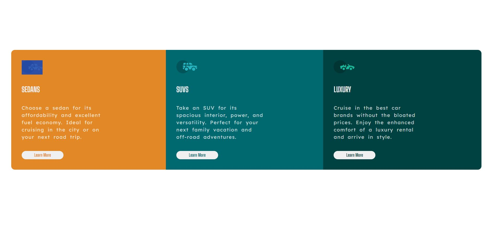
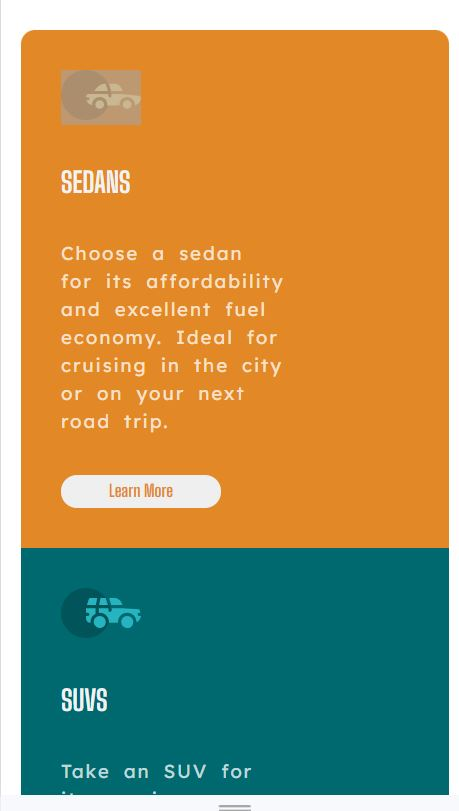

# Frontend Mentor - 3-column preview card component solution

This is a solution to the [3-column preview card component challenge on Frontend Mentor](https://www.frontendmentor.io/challenges/3column-preview-card-component-pH92eAR2-). Frontend Mentor challenges help you improve your coding skills by building realistic projects. 

## Table of contents

- [Overview](#overview)
  - [The challenge](#the-challenge)
  - [Screenshot](#screenshot)
  - [Links](#links)
- [My process](#my-process)
  - [Built with](#built-with)
  - [What I learned](#what-i-learned)
  - [Continued development](#continued-development)
  - [Useful resources](#useful-resources)
- [Author](#author)
- [Acknowledgments](#acknowledgments)

**Note: Delete this note and update the table of contents based on what sections you keep.**

## Overview

### Screenshot

### Links

- Solution URL: [3-Column-Component](https://github.com/MarkPraise/3-column-preview-card-Component)
- Live Site URL: [3 Column -Component](https://markpraise.github.io/3-column-preview-card-Component/)

## My process
- I built the Mobile Layout First
- I Completed the Mobile Layout First before using Media Queries to make the Layout 
  for Bigger Screen Sizes.

### Built with

- Semantic HTML5 markup
- CSS custom properties
- Flexbox
- Mobile-first workflow

### What I learned

  - Media Queries

### Continued development

- Responsive Layout
- Accessibility

## Author

- Frontend Mentor - [@MarkPraise](https://www.frontendmentor.io/profile/MarkPraise)
- Twitter - [@Praise5Mark](https://www.twitter.com/Praise5Mark)

## Acknowledgments

  -I owe Everything to Odin Project,Youtube, and Google for being Very Patient      with   me

